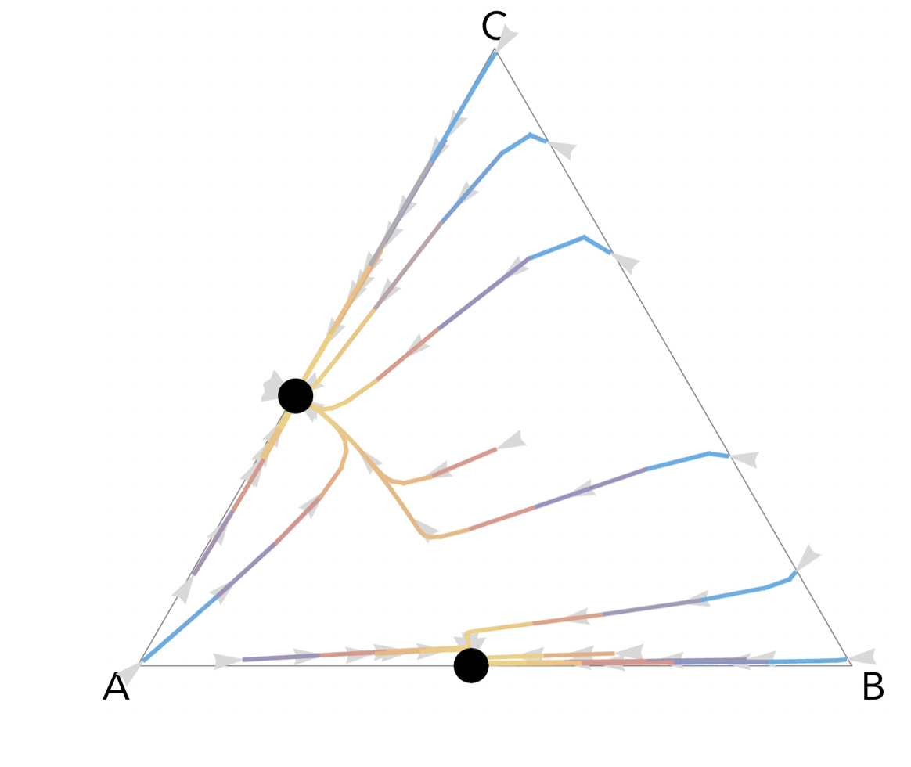
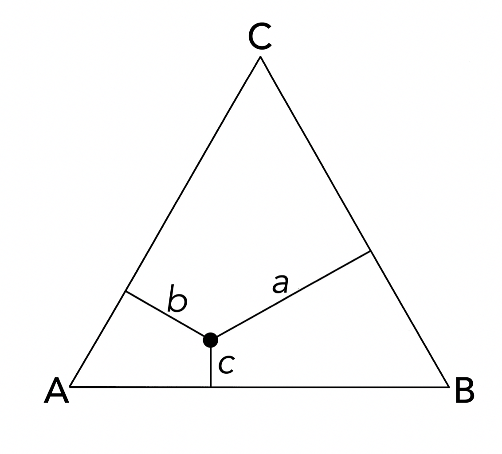
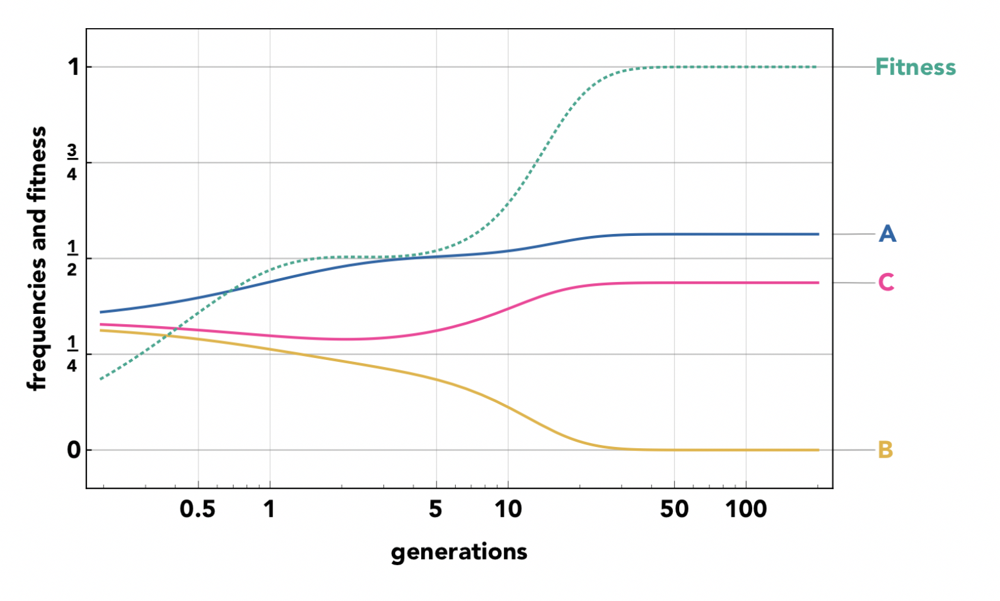
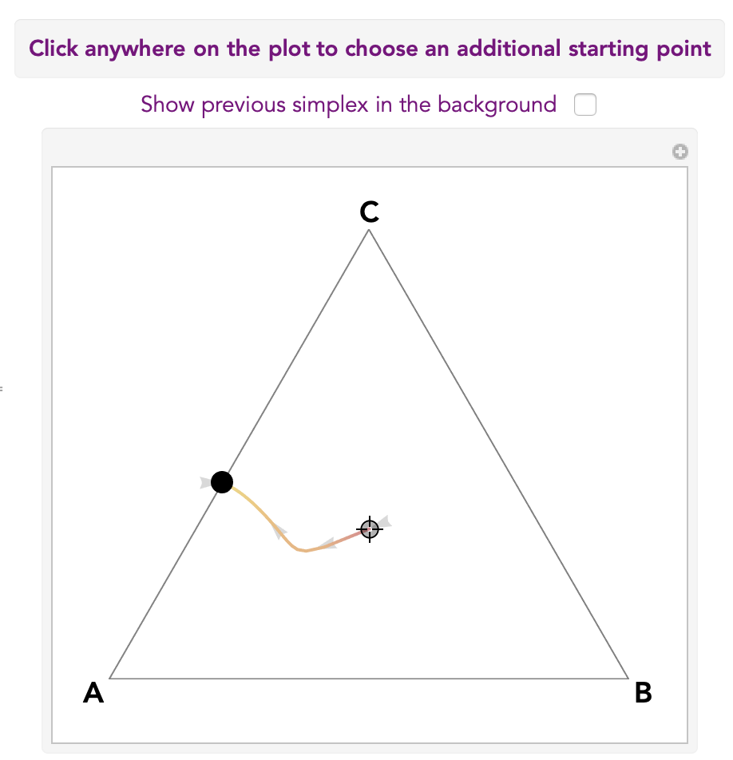
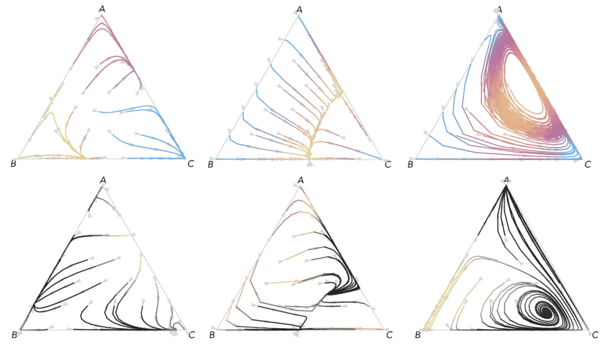

# DeFinetti #

## What the program does ##

It produces ternary plots (De Finetti diagrams) for three-strategy multiplayer games.

In a ternary plot, the proportions a, b, c of three types A, B and C are described by the position of a point within an equilateral triangle; the distances of this point from the sides opposite to the vertices correspond to the proportions of the respective types; vertices correspond to pure types. 

The code computes the replicator dynamics of multiplayer games with three strategies in which fitness is given by the payoff of a public goods game, with parameters chosen by the user. The resulting plots show the change in frequency of the three types and the average fitness of the population over time

as well as ternary plots with style that can be customised using interactive input fields, sliders and popup menus. 

These are examples of the output:

## Dependencies ##

The program is written in (and requires) [Mathematica](http://www.wolfram.com/mathematica/). It is tested in Mathematica 11.1.1.0.

## How to run it ##

Simply download, open and run the [notebook](DeFinetti.nb). 

## Examples ##

Publications in which the program has been used:
1. [Nonlinear public goods games](https://archive.uea.ac.uk/~zzq12vpu/papers/GAMES_2018_Bernstein.pdf)
2. [Game theory of cancer](https://archive.uea.ac.uk/~zzq12vpu/papers/GAMES_2018_MM.pdf)

## Author ##

[Marco Archetti](https://bio.psu.edu/directory/mua972)
